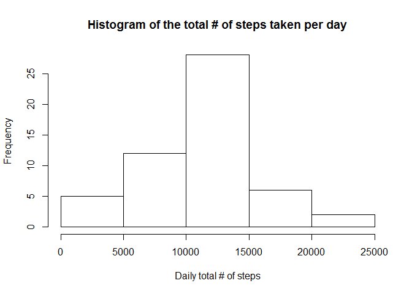
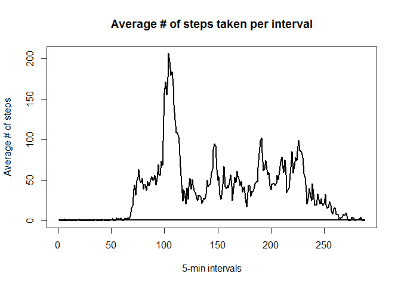
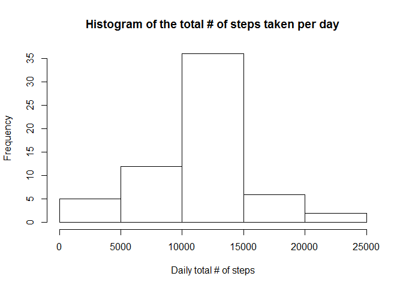
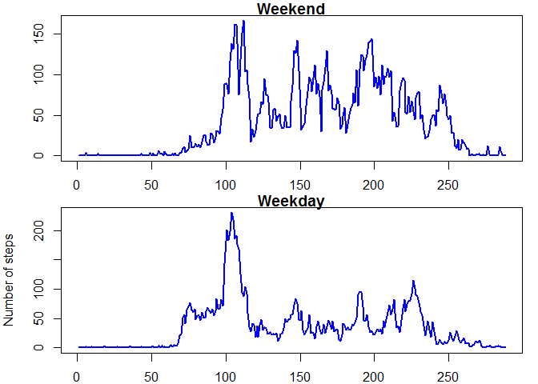

# Reproducible Research: Peer Assessment 1


## Loading and preprocessing the data
Unzip the input file and load it into a data frame  


```r
unzip("activity.zip")
input <- read.csv("activity.csv")
```


## What is the mean and median total number of steps taken per day?  
Ignore the missing values  
Histogram of the total number of steps taken per day  
Report the mean and median of the total number of steps taken per day    


```r
input1 <- na.omit(input)
sumSteps <- tapply(input1$steps, input1$date, sum, na.rm=TRUE)
hist(sumSteps, main="Histogram of the total # of steps taken per day", xlab="Daily total # of steps")
```

 

```r
mean(sumSteps, na.rm=TRUE)
```

```
## [1] 10766.19
```

```r
median(sumSteps, na.rm=TRUE)
```

```
## [1] 10765
```

## What is the average daily activity pattern?  
The interval is composed of two parts: the hour and minute.  But it leaves a gap between the last interval of the previous hour and the first interval of the next hour (e.g. 2155 and 2200).  To simplify the time-series plot, the interval is converted to a numeric value.  


```r
input <- transform(input, interval = factor(interval))
input$dailyAvg <- tapply(input$steps, input$interval, mean, na.rm=TRUE)
modInterval <- as.numeric(input$interval)
plot(modInterval, input$dailyAvg, type="l", lwd=2, main="Average # of steps taken per interval", xlab="5-min intervals", ylab="Average # of steps")
```

 


The interval, on average across all the days in the dataset, that contains the maximum number of steps


```r
maximum <- max(input$dailyAvg)
unique(input[input$dailyAvg == maximum,]$interval)
```

```
## [1] 835
## 288 Levels: 0 5 10 15 20 25 30 35 40 45 50 55 100 105 110 115 120 ... 2355
```


## Imputing missing values
Compute the total number of missing values:

```r
ok <- complete.cases(input)
sum(!ok)
```

```
## [1] 2304
```

  
  
Fill in the missing values with the mean for that 5-minute interval and create a new dataset


```r
impData <- data.frame()

for (i in 1:nrow(input)) {
    impData <- rbind(impData,input[i,])
    if (is.na(input[i, "steps"])) {
      impData[i, "steps"] <- input[i, "dailyAvg"]
    }
}
```

  

A histogram of the total number of steps taken each day using the imputed data and the mean and median total number of steps taken per day. 
  
  

```r
impSumSteps <- tapply(impData$steps, impData$date, sum)
hist(impSumSteps, main="Histogram of the total # of steps taken per day", xlab="Daily total # of steps")
```

 

```r
mean(impSumSteps)
```

```
## [1] 10766.19
```

```r
median(impSumSteps)
```

```
## [1] 10766.19
```


###Do these values differ from the estimates from the first part of the assignment?   

No, because in the first part, we removed all the days that didn't have any steps recorded.  We removed 8 days that didn't have any activities recorded (NA values for all intervals).    


```r
mean(impSumSteps) - mean(sumSteps, na.rm=TRUE)
```

```
## [1] 0
```

###What is the impact of imputing missing data on the estimates of the total daily number of steps?  
The total daily number of steps increased after we filled in the missing data for those days that had NA values.  


## Are there differences in activity patterns between weekdays and weekends?  
Convert the date, which is a factor, into the Date object and call the Weekdays function to determine the day of the week.  Then create a factor by using Saturday and Sunday as a weekend and the other days as weekdays.


```r
dates <- as.Date(impData$date)
dates <- weekdays(dates)
impData$weekend <- as.factor(ifelse(dates %in% c("Saturday", "Sunday"), "Weekend", "Weekday"))
```

  
Make two time series plots of the 5-minute interval (x-axis) and the average number of steps taken, averaged across weekdays and weekends (y-axis): one for the weekdays and one for the weekends.
  


```r
impData <- transform(impData, interval = factor(interval))
means <- tapply(impData$steps, list(impData$weekend, impData$interval), mean, na.rm=TRUE)
modInterval <- as.numeric(impData$interval)
par(mfrow = c(2, 1), mar=c(2,4,1,1))
plot(means[2,], type="l", xlab = "", ylab="", main="Weekend", col="blue", lwd=2)
plot(means[1,], type="l", xlab = "Interval", ylab="Number of steps", main="Weekday", col="blue", lwd=2)
```

 
